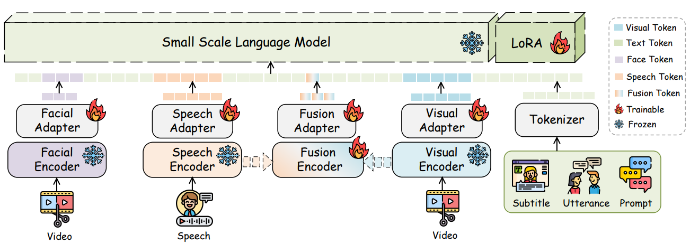

<div align="center">

<h2>[CVPR 2026] Nano-EmoX: Unifying Multimodal Emotional Intelligence from Perception to Empathy</h2>

<a href="https://arxiv.org/pdf/2603.02123">
</a>
<a href="https://huggingface.co/datasets/">
</a>
<a href="#">
</a>

</div>

## Todo List

- [x] release paper
- [x] release project codes
- [x] training and evaluation scripts
- [ ] model weights

## Unified Emotion Intelligence

our model is first compact (2.2B) emotion intelligence Multimodel Langugage Model. It integrates a pretrained LLM with modality-specific encoders and experts-based fusion encoder to handle a broad spectrum of affective tasks in one model.

Nano-EmoX supports six core tasks within one model: 1), Multimodal Sentiment Analysis. 2), Multimodal Emotion Recognition. 3), Open-Vocabulary Multimodal Emotion Recognition. 4), Multimodal Intention Recognition. 5), Emotion Reason Inference. 6), Empathic Response Generation



- **Visual Encoder**: a visual encoder (CLIP-Large) produces frame-level representations, followed by Q-Former, then a projection to the LLM hidden space.
- **Audio Encoder**: an acoustic encoder (HuBERT-Large) is paired with an Q-Former and projected into the LLM hidden space.
- **Facial Encoder**: a facial encoder (FaceXFormer encoder only + temporal modeling) extracts face–aware features and maps them into the LLM space.
- **Fusion Encoder**: It consists of three independent fusion experts and a gating network. Fusion encoder fuses video and audio features before injecting them into the LLM.
- **LLM backbone**: a frozen causal samll scale LM (Qwen-2.5-1.5B) is adapted with lightweight LoRA layers for efficient fine-tuning.
- **Unified prompt injection**: modality tokens are replaced by learned embeddings so that all modalities align in the LLM embedding space.

## P2E training framework (Three Phase)

We train Nano-EmoX with a three-phase curriculum that gradually increases emotional intelligence:


This staged curriculum progressively strengthens the model’s perception, fusion, and reasoning over multimodal affective cues.

## Performance


## Quick Start

### Environment Installation

```bash
conda env create -f environment.yml
conda activate nanoemox
```

### Model Weights

| Model Name                                                                          |   Model Type   |
| :---------------------------------------------------------------------------------- | :------------: |
| [clip-vit-large-patch14](https://huggingface.co/openai/clip-vit-large-patch14)      | Visual Encoder |
| [chinese-hubert-large](https://huggingface.co/TencentGameMate/chinese-hubert-large) |  Audio Encoder |
| [faceformer](https://huggingface.co/kartiknarayan/facexformer)                      | Facial Encoder |
| [Qwen2.5-1.5B-Instruct](https://huggingface.co/Qwen/Qwen2.5-1.5B-Instruct)          |       LLM      |
| [Qwen2.5-7B-Instruct](https://huggingface.co/Qwen/Qwen2.5-7B-Instruct)              |       LLM      |

### Datasets

- **For training**:
  - [MER-Caption+](https://github.com/zeroQiaoba/AffectGPT): Large-scale descriptive emotion dataset caption from MER2025
  - [CREMA-D](https://github.com/CheyneyComputerScience/CREMA-D): Crowd-sourced emotional multimodal actors dataset with 7,442 clips (IEEE TAC 2014)
  - [M3ED](https://github.com/AIM3-RUC/RUCM3ED): Multi-modal multi-scene multi-label emotional dialogue dataset in Chinese (ACL 2022)
  - [CAER](https://caer-dataset.github.io/): Context-aware emotion recognition dataset with 13K+ annotated videos (ICCV 2019)
  - [FERV39k](https://github.com/wangyanckxx/FERV39k): Large-scale multi-scene dataset for dynamic facial expression recognition in videos (CVPR 2022)
  - [MIntRec](https://github.com/thuiar/MIntRec): Multimodal intent recognition dataset (ACM MM 2022)
  - [MIntRec2.0](https://github.com/thuiar/MIntRec2.0): Large-scale multimodal intent dataset with 15K samples and 30 intent classes (ICLR 2024)
  - [AvaMERG](https://avamerg.github.io/): Avatar-based multimodal empathetic response generation dataset (WWW 2025)
  
  Place training data under `data/` directory, And modify the path of the data in the configuration file `config.py`.
  
- **For evaluation**: Benchmarks from [MER-UniBench](https://github.com/zeroQiaoba/AffectGPT), including:
  - MER2023, MER2024, MELD, IEMOCAP, CMU-MOSI, CMU-MOSEI, SIMS, SIMSv2 (emotion recognition & sentiment analysis)
  - [MIntRec](https://github.com/thuiar/MIntRec), [MIntRec2.0](https://github.com/thuiar/MIntRec2.0) (multimodal intention recognition)
  - [AvaMERG](https://avamerg.github.io/) (multimodal empathetic response generation)

### Training

- **Phase 1**: Modality alignment, these two steps are independent and can be trained simultaneously
  ```bash
  CUDA_VISIBLE_DEVICES=0 python -u train.py --cfg-path=configs/phase1_1.yaml
  CUDA_VISIBLE_DEVICES=0 python -u train.py --cfg-path=configs/phase1_2.yaml
  ```
- **Phase 2**: Train fusion encoder
  ```bash
  CUDA_VISIBLE_DEVICES=0 python -u train.py --cfg-path=configs/phase2.yaml
  ```
- **Phase 3**: End-to-end fine-tuning
  ```bash
  CUDA_VISIBLE_DEVICES=0 python -u train.py --cfg-path=configs/phase3.yaml
  ```

### Inference

- **Inference on emotion recognition task** with emotion analysis&recognition:
  ```bash
  CUDA_VISIBLE_DEVICES=0 python -u inference_hybird.py \
    --zeroshot --dataset='merunibench' \
    --cfg-path=configs/phase3.yaml \
    --options "inference.test_epochs=40-60" \
    --outside_face_or_frame multiface_audio_face_frame_text \
    --emotion_reason_inference
  ```
- **Inference on emotion reason inference task** with emotion reason inference:
  ```bash
  CUDA_VISIBLE_DEVICES=0 python -u inference_hybird.py \
    --zeroshot --dataset='emer' \
    --cfg-path=configs/phase3.yaml \
    --options "inference.test_epochs=55-60" \
    --outside_face_or_frame multiface_audio_face_frame_text \
    --emotion_reason_inference
  ```
  - **Inference on intention recognition task** with intent recognition:
  ```bash
  CUDA_VISIBLE_DEVICES=0 python -u inference_hybird.py \
    --zeroshot --dataset='mintrec' \
    --cfg-path=configs/phase3.yaml \
    --options "inference.test_epochs=55-60" \
    --outside_face_or_frame multiface_audio_face_frame_text \
    --emotion_reason_inference
  ```
- **Inference on empathic response task**:
  ```bash
  CUDA_VISIBLE_DEVICES=1 python -u inference_hybird.py \
    --zeroshot --dataset='avamerg' \
    --cfg-path=configs/phase3.yaml \
    --options "inference.test_epochs=30-60" "inference.skip_epoch=5" \
    --outside_face_or_frame
  ```

### Evaluation

Specify the config file in `evaluation-scoreonly.py` to select the model for evaluation. It will automatically evaluate the inference results with the latest timestamp.

```bash
CUDA_VISIBLE_DEVICES=0 python -u evaluation-scoreonly.py
```
To evaluate the emotional reason inference task, we need an API from OpenAI to call an external model for assessing the quality of the reasoning.
```bash
python eval_ovmerd.py --data_root output/ov-merd-eval/model_output_path --openai_key sk-************
```

## License

This project is licensed under the MIT License - see the [LICENSE](LICENSE) file for details.

## Citation

If this work has been helpful or inspiring to your research, please consider cite our article:

```bibtex
@InProceedings{Huang_2026_CVPR,
    author    = {Huang, Jiahao and Lin, Fengyan and Yang, Xuechao and Feng, Chen and Zhu, Kexin and Yang, Xu and Chen, Zhide},
    title     = {Nano-EmoX: Unifying Multimodal Emotional Intelligence from Perception to Empathy},
    booktitle = {Proceedings of the IEEE/CVF Conference on Computer Vision and Pattern Recognition (CVPR)},
    month     = {June},
    year      = {2026},
    pages     = {22986-22997}
}

```

