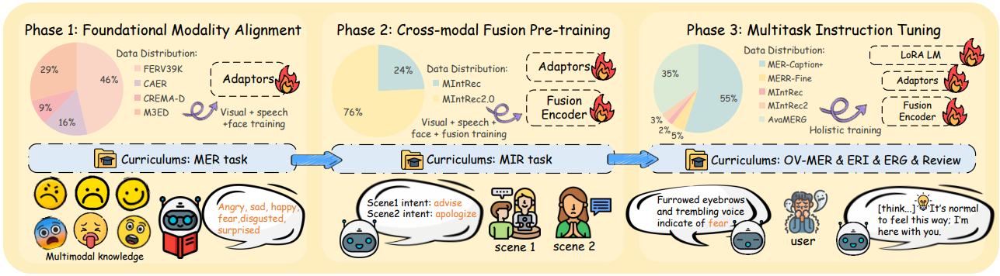
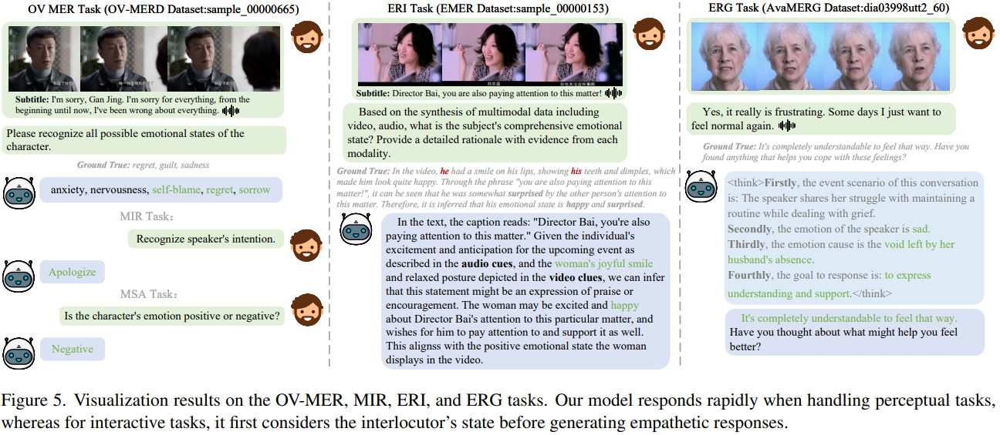
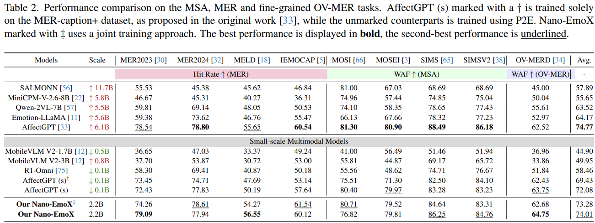
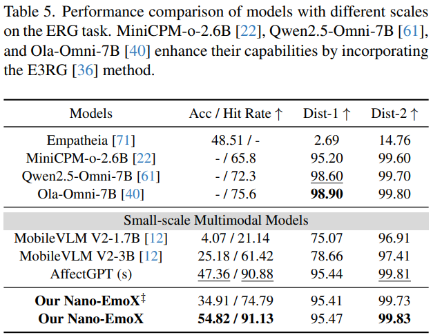

  <h2 align="center">[CVPR 2026] Nano-EmoX: Unifying Multimodal Emotional Intelligence from Perception to Empathy
</h2>
     
        
        
        

## Todo List

- [x] paper
- [ ] training code
- [ ] model weights

## Unified Emotion Intelligence
our model is first compact (2.2B) emotion intelligence videoLM. It integrates a pretrained LLM with modality-specific encoders and experts-based fusion encoder to handle a broad spectrum of affective tasks in one model. 

Nano-EmoX supports six core tasks within one model:

1. Multimodal Sentiment Analysis
2. Multimodal Emotion Recognition
3. Open-Vocabulary Multimodal Emotion Recognition
4. Multimodal Intention Recognition
5. Emotion Reason Inference
6. Empathic Response Generation

- **Visual Encoder**: a visual encoder (CLIP-Large) produces frame-level representations, followed by Q-Former, then a projection to the LLM hidden space.
- **Audio Encoder**: an acoustic encoder (HuBERT-Large) is paired with an Q-Former and projected into the LLM hidden space.
- **Facial Encoder**: a facial encoder (FaceXFormer encoder only + temporal modeling) extracts face–aware features and maps them into the LLM space.
- **Fusion Encoder**: It consists of three independent fusion experts and a gating network. Fusion encoder fuses video and audio features before injecting them into the LLM.
- **LLM backbone**: a frozen causal samll scale LM (Qwen-2.5-1.5B) is adapted with lightweight LoRA layers for efficient fine-tuning.
- **Unified prompt injection**: modality tokens are replaced by learned embeddings so that all modalities align in the LLM embedding space.

## P2E training framework (Three Phase)

We train Nano-EmoX with a three-phase curriculum that gradually increases emotional intelligence:

- **Phase 1**: config file: `xemo_phase1.yaml` and `xemo_phase2.yaml` (modality alignment)
- **Phase 2**: config file: `xemo_phase3.yaml` (train fusion encoder)
- **Phase 3**: config file: `xemo_phase4.yaml`

This staged curriculum progressively strengthens the model’s perception, fusion, and reasoning over multimodal affective cues.

## Performance

## License

This project is licensed under the MIT License - see the [LICENSE](LICENSE) file for details.
